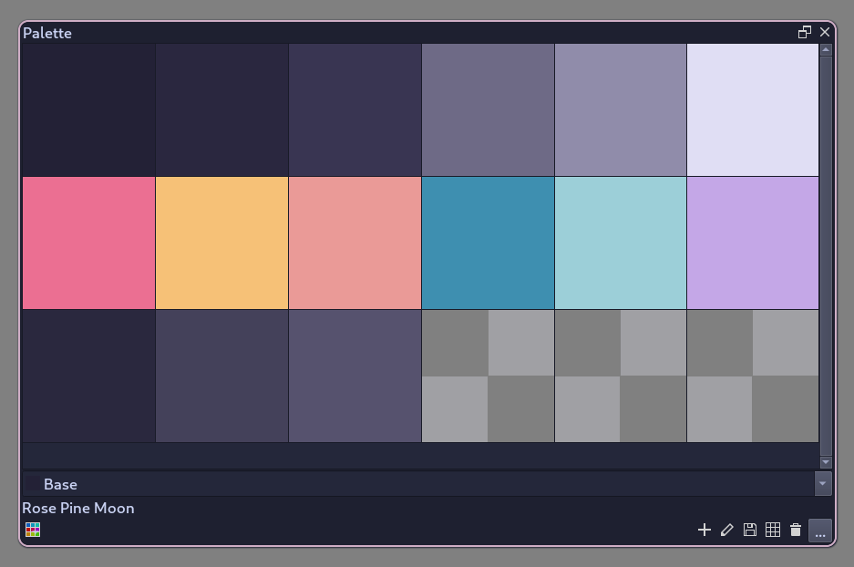

<h1 align="center">GPL Color Palettes</h1>

A collection of .gpl palettes usable for Krita, GIMP, Inkscape, Aseprite, Drawpile, and MyPaint.

## Included Palettes

- [Catppuccin](https://catppuccin.com/)
- [Dracula](https://draculatheme.com/)
- [Gruvbox](https://github.com/morhetz/gruvbox)
- [Kanagawa](https://github.com/rebelot/kanagawa.nvim)
- [Rosé Pine](https://rosepinetheme.com/)
- [Tokyo](https://github.com/enkia/tokyo-night-vscode-theme) [Night](https://github.com/folke/tokyonight.nvim)

## Installation

### Krita

#### Within Krita

1. Download your desired palette file(s)
2. Open Krita's palette docker
3. Click on `Load a palette`, the colorful icon in the bottom left
4. Click on `Import a new palette from file`
5. Select your desired palette file

#### Linux Manually

1. Download your desired palette file(s)
2. Move the file(s) into `~/.local/share/krita/palettes`
3. If Krita is open, restart Krita

#### Mac Manually

1. Download your desired palette file(s)
2. Move the file(s) into `~/Library/Application Support/krita/palettes`
3. If Krita is open, restart Krita

#### Windows Manually

1. Download your desired palette file(s)
2. Move the files(s) into `C:\Users\USERNAME\AppData\Roaming\krita\palettes`
3. If Krita is open, restart Krita

## TODO

- [ ] Add installation instructions
  - [ ] GIMP
- [ ] Ayu
- [ ] Nord
